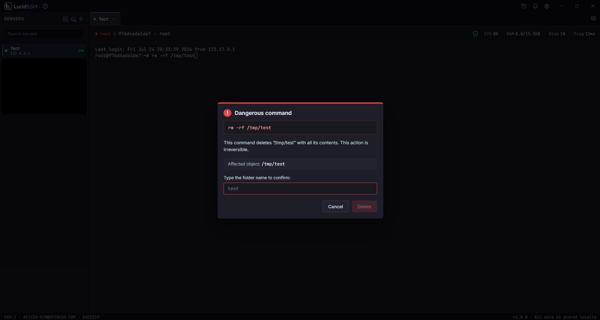
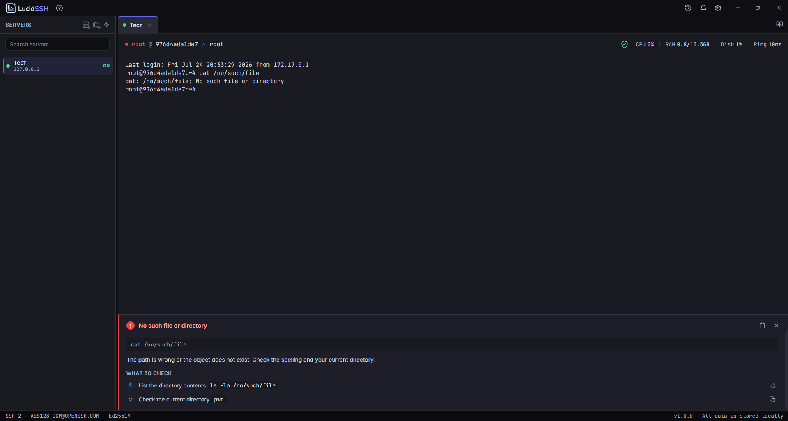
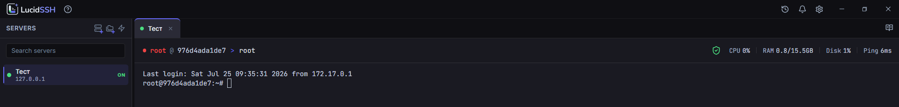
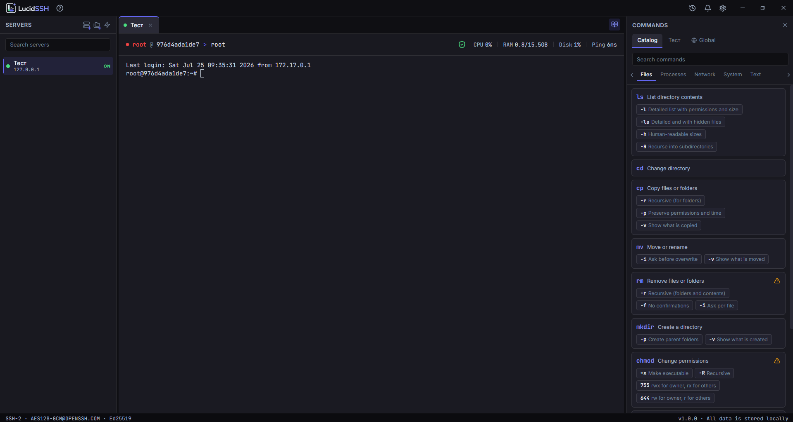

<picture>
  <source media="(prefers-color-scheme: dark)" srcset="docs/assets/logo-dark.svg">
  <source media="(prefers-color-scheme: light)" srcset="docs/assets/logo-light.svg">
  
</picture>

[🇷🇺 Русский](README.md) | 🇬🇧 English

An SSH client for Windows that explains what's happening and stops you from breaking your server by accident.

---

## Why another SSH client

PuTTY is reliable but doesn't explain errors or warn you about dangerous commands. Termius looks great but requires a subscription and an account, and your keys go to the cloud. MobaXterm is packed with features most people need once a year.

LucidSSH fills a different gap: it's for people who manage one or two servers, aren't professional sysadmins, and want to understand what's happening — without extra effort.

*Note: screenshots below show the Russian locale (the default). An English UI is also built in and can be switched in Settings.*

---

## Key features

### Dangerous Command Guard

Before running `rm -rf`, `dd`, `mkfs`, `chmod 777`, and similar commands, the app stops execution and explains exactly what will happen. Confirmation requires manually typing the name of the object being affected — not just clicking "OK". The Guard warns about **recognized** dangerous commands; it's protection against mistakes, not a guarantee against every destructive action.

### Error Detector

After every failed command, a panel explains what went wrong. `Permission denied` gives you a list of causes and concrete checks. `Connection refused` shows how it differs from `Connection timed out`. Works fully offline, from a built-in database, with nothing sent anywhere.

### "Where am I" breadcrumb and a mini server dashboard

The bar above the terminal always shows which server you're on, as which user, and in which folder. Each path segment is clickable and inserts itself into the input line. A root session is highlighted in red. Next to it, a compact CPU/RAM/disk/ping line updates every 10 seconds over a background channel without interrupting your work.

### Command catalog

A sidebar with plain-language explanations: what a command does, what each flag means, examples. Clicking a flag inserts the command into the terminal.

### History with notes

Every command is saved locally with a timestamp, host name, and exit code. You can attach a note to any entry, and search across commands and notes. Common secrets (passwords, tokens, keys typed into a command) are masked before being saved.

### Fully local

No account, no cloud, no telemetry. Passwords live in Windows Credential Manager. Private keys stay where they already are — the app never copies them into its own directory. The only outbound connections are SSH to your own servers and an HTTPS update check.

---

## Who it's for

- First-time connection to a VPS, home server, NAS, or Raspberry Pi
- Managing a handful of servers in a home lab
- Developers who want quick SSH access without the extra weight
- PuTTY users tired of juggling one window per server

---

## Installation

1. Download `LucidSSH-Setup-x.x.x-x64.exe` from [Releases](https://github.com/Xykyma/LucidSSH/releases).
2. Verify the SHA-256 checksum — it's published in the release description.
3. Run the installer.

**About the Windows SmartScreen warning.** Version 1.0 ships without a code-signing certificate — that's a deliberate, deferred decision, not an oversight. Because of this, Windows may show a "Windows protected your PC" warning on first launch. This is expected for new unsigned apps and doesn't mean the file is corrupted — click "More info" → "Run anyway". You can additionally verify the SHA-256 checksum against the downloaded file if you want extra assurance.

### System requirements

- Windows 10 (version 1903+) or Windows 11, x64
- 200 MB RAM idle

---

## Privacy

LucidSSH collects no telemetry, requires no account, and sends data nowhere except your own servers. The only outbound traffic the app initiates itself:

- SSH connections to the hosts you add;
- a check for new versions against GitHub Releases (on demand and at startup, non-blocking).

Passwords are stored in Windows Credential Manager. Private keys are never copied into the app's directory — the original path on disk is used.

---

## What's not in version 1.0

An SFTP browser, Mosh, Telnet, RDP, VNC, X11, Serial, cloud sync, and a mobile version — either planned for future releases or not planned at all.

Local, offline AI-powered explanations are planned for version 1.2, to complement the built-in databases for rare commands and non-standard errors. In version 1.0, the built-in command and error databases already provide immediate value — no model downloads, no setup.

---

## Stack

Electron · TypeScript · React · xterm.js · ssh2 · SQLite (better-sqlite3) · Windows Credential Manager (keytar)

---

## License

The source code is available to view, but it is **not licensed** for use, copying, modification, or distribution without the author's explicit permission (all rights reserved). This is a deliberate choice while the project's monetization model is still being decided — an open license would foreclose future options. If you're interested in using LucidSSH's code in your own project, reach out and let's talk.

---

## Security

Found a vulnerability? Please don't open a public Issue. Report it privately via **[GitHub Security Advisory](https://github.com/Xykyma/LucidSSH/security/advisories/new)** — details in [SECURITY.md](SECURITY.md).

---

## Feedback

Bug reports and feature requests go through [Issues](https://github.com/Xykyma/LucidSSH/issues). Pull requests aren't accepted yet — this is a solo, actively developed project.

---

## Status

Version 1.0 is released. Future plans are tracked in [Releases](https://github.com/Xykyma/LucidSSH/releases) and the changelog.
