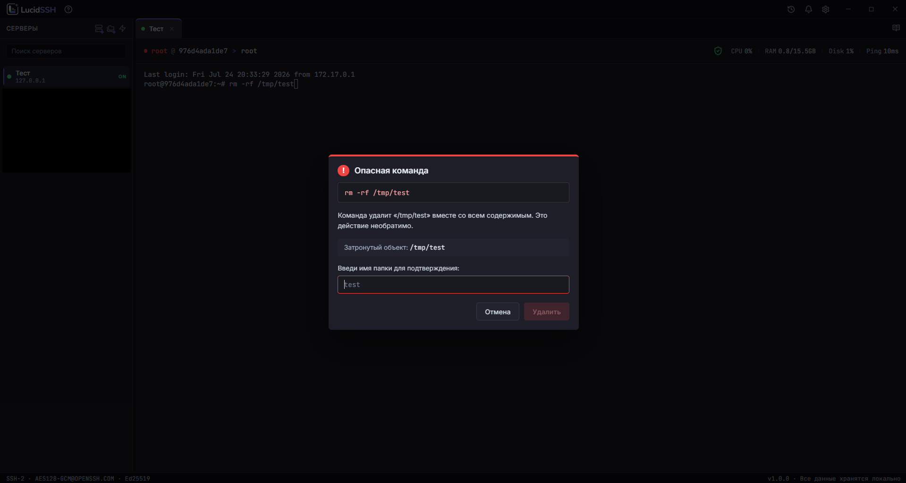
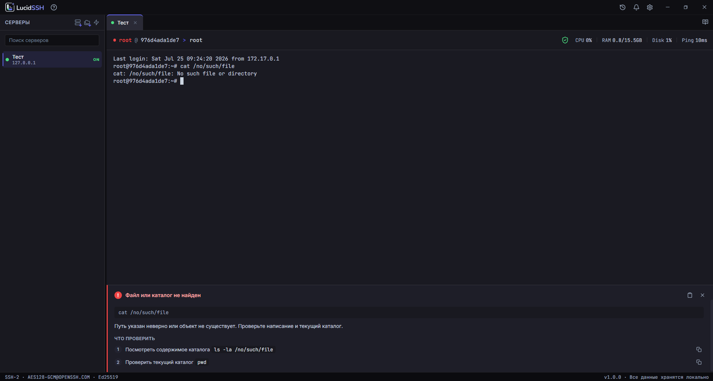
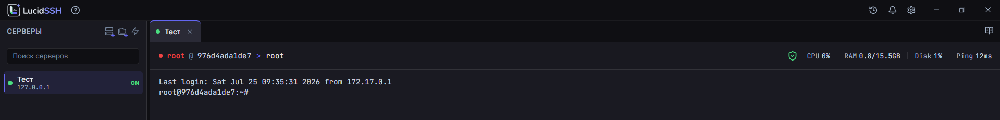
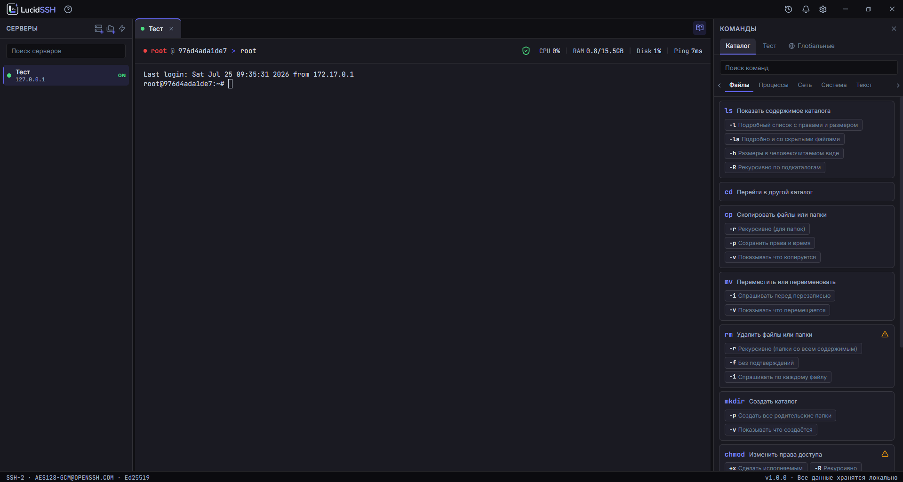

<picture>
  <source media="(prefers-color-scheme: dark)" srcset="docs/assets/logo-dark.svg">
  <source media="(prefers-color-scheme: light)" srcset="docs/assets/logo-light.svg">
  
</picture>

🇷🇺 Русский | [🇬🇧 English](README.en.md)

SSH-клиент для Windows, который объясняет что происходит и не даёт случайно сломать сервер.

---

## Зачем ещё один SSH-клиент

PuTTY надёжный, но не объясняет ошибки и не предупреждает об опасных командах. Termius красивый, но требует подписку и аккаунт, а ключи уходят в облако. MobaXterm перегружен возможностями, которые нужны раз в год.

LucidSSH занимает другую нишу: он для тех, кто управляет одним-двумя серверами, не является профессиональным сисадмином и хочет понимать что происходит — без лишних усилий.

---

## Ключевые возможности

### Страж опасных команд

Перед выполнением `rm -rf`, `dd`, `mkfs`, `chmod 777` и подобных команд приложение останавливает выполнение и объясняет по-русски что именно произойдёт. Для подтверждения нужно вручную ввести имя удаляемого объекта — не просто нажать «ок». Страж предупреждает о **распознанных** опасных командах; это помощь против случайной ошибки, а не гарантия от любого разрушительного действия.

### Детектор ошибок

После каждой неудачной команды появляется панель с объяснением. `Permission denied` — получишь список причин и конкретные проверки. `Connection refused` — узнаешь чем это отличается от `Connection timed out`. Работает офлайн, по встроенной базе, без отправки данных куда-либо.

### Breadcrumb «где я» и мини-дашборд сервера

Над терминалом всегда видно: к какому серверу подключён, под каким пользователем, в какой папке. Каждый элемент пути кликабелен — вставляет путь в строку ввода. Root-сессия выделяется красным. Рядом — компактная строка CPU/RAM/диска/пинга, обновляется каждые 10 секунд через фоновый канал и не мешает основной работе.

### Каталог команд

Боковая панель с объяснениями на русском языке: что делает команда, какие флаги для чего, примеры. Клик по флагу вставляет команду в терминал. Поиск по-русски: «удалить» найдёт `rm`.

### История с заметками

Все команды сохраняются локально с временем, именем хоста и exit code. К любой записи можно добавить заметку. Поиск по командам и заметкам. Типичные секреты (пароли, токены, ключи в команде) маскируются перед сохранением.

### Полностью локально

Никакого аккаунта, никакого облака, никакой телеметрии. Пароли хранятся в Windows Credential Manager. Приватные ключи остаются там, где лежат — приложение не копирует их к себе. Единственные внешние соединения — SSH к твоим серверам и проверка обновлений по HTTPS.

---

## Для кого

- Первое подключение к VPS, домашнему серверу, NAS или Raspberry Pi
- Несколько серверов в домашней лаборатории
- Разработчик, которому нужны быстрые SSH-подключения без лишнего
- Пользователь PuTTY, которому надоело открывать по одному окну на каждый сервер

---

## Установка

1. Скачай `LucidSSH-Setup-x.x.x-x64.exe` со страницы [Releases](https://github.com/Xykyma/LucidSSH/releases).
2. Проверь целостность файла по SHA-256 — контрольная сумма опубликована в описании релиза.
3. Запусти установщик.

**О предупреждении Windows SmartScreen.** Версия 1.0 выходит без сертификата подписи кода (сертификат — платный и отложен на будущее сознательно). Из-за этого при первом запуске Windows может показать предупреждение «Windows защитила ваш компьютер». Это ожидаемо для новых неподписанных приложений и не означает, что файл повреждён — просто нажми «Подробнее» → «Выполнить в любом случае». Сверь SHA-256 из релиза с файлом, который скачал, если хочешь дополнительно убедиться в целостности.

### Системные требования

- Windows 10 (версия 1903+) или Windows 11, x64
- 200 МБ RAM в простое

---

## Приватность

LucidSSH не собирает телеметрию, не требует аккаунта и не отправляет данные никуда, кроме твоих собственных серверов. Единственный исходящий трафик, который приложение инициирует само:

- SSH-соединения к хостам, которые ты добавил;
- проверка новых версий на GitHub Releases (по запросу и при старте, не блокирует работу).

Пароли хранятся в Windows Credential Manager. Приватные ключи не копируются в директорию приложения — используется оригинальный путь на диске.

---

## Что не входит в версию 1.0

SFTP-браузер, Mosh, Telnet, RDP, VNC, X11, Serial, облачная синхронизация, мобильная версия — запланированы в следующих версиях или не планируются вовсе.

Локальные ИИ-объяснения (офлайн, без облака) запланированы на версию 1.2: они будут дополнять встроенные базы для редких команд и нестандартных ошибок. В версии 1.0 мгновенную ценность дают встроенные базы команд и ошибок — без скачивания моделей и настройки.

---

## Стек

Electron · TypeScript · React · xterm.js · ssh2 · SQLite (better-sqlite3) · Windows Credential Manager (keytar)

---

## Лицензия

Исходный код открыт для просмотра, но **не лицензирован** для использования, копирования, модификации или распространения без явного разрешения автора (все права защищены). Причина — проект в процессе поиска модели монетизации, и открытая лицензия ограничила бы будущие варианты. Если тебе интересно использовать код LucidSSH в своём проекте — напиши, обсудим.

---

## Безопасность

Нашёл уязвимость? Пожалуйста, не создавай публичный Issue. Сообщи через приватный **[GitHub Security Advisory](https://github.com/Xykyma/LucidSSH/security/advisories/new)** — подробности в [SECURITY.md](SECURITY.md).

---

## Обратная связь

Баг-репорты и предложения — через [Issues](https://github.com/Xykyma/LucidSSH/issues). Pull request'ы пока не принимаются — проект в активной разработке одним автором.

---

## Статус

Версия 1.0 выпущена. Дальнейшие планы — в [Releases](https://github.com/Xykyma/LucidSSH/releases) и changelog.
